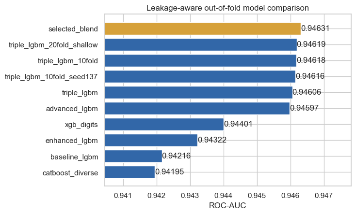
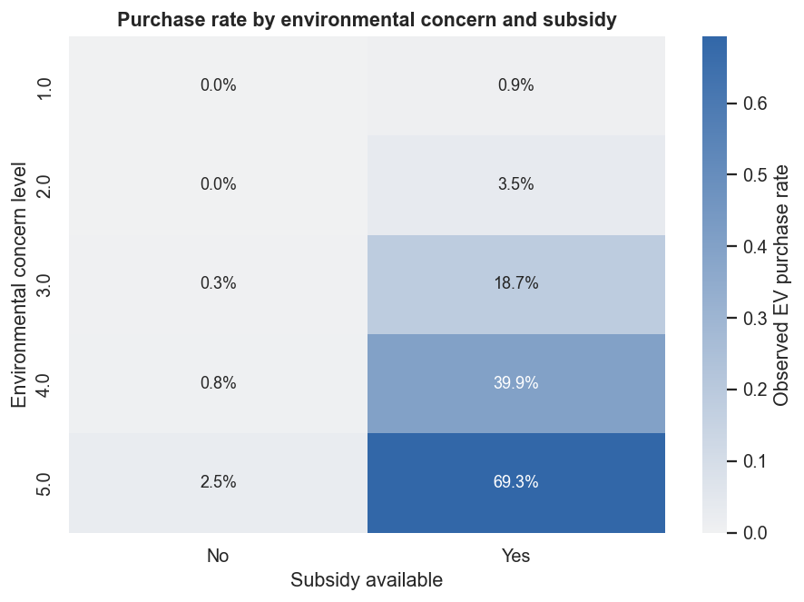

# Predicting Electric Vehicle Purchases

[](https://www.python.org/)
[](LICENSE)
[](https://www.kaggle.com/competitions/playground-series-s6e9)

A leakage-aware, reproducible tabular machine-learning project for the Kaggle
Playground Series Season 6, Episode 9. The task is to predict the probability
that a customer will purchase an electric vehicle.

> **Original-model result, updated 2026-09-27:** leakage-safe OOF ROC-AUC
> improved from **0.946072** to **0.946314**. The final SHA-matched artifact
> scored **0.94641** on the public leaderboard, up from **0.94627**. The same-day
> Top-10% cutoff was approximately **0.94650**, so this original model did not
> reach the target; the gap is reported rather than hidden.

## Result at a glance

| Model | Leakage-safe OOF ROC-AUC |
|---|---:|
| CatBoost | 0.94195 |
| LightGBM baseline | 0.94216 |
| LightGBM with frequency features | 0.94322 |
| XGBoost with digit features | 0.94401 |
| XGBoost with leave-one-out target encoding (rejected) | 0.90200 |
| Triple-encoding LightGBM | 0.94606 |
| Feature-cross LightGBM | 0.94597 |
| 10-fold triple-encoding LightGBM | 0.94618 |
| Repeated-seed 10-fold triple-encoding LightGBM | 0.94616 |
| 20-fold shallow triple-encoding LightGBM | 0.94619 |
| **Selected repeated-CV rank blend** | **0.94631** |

The final blend combines two 10-fold seeds and a shallower 20-fold LightGBM
with smaller contributions from the 5-fold, cross-feature and XGBoost views.
It improves over the best individual model on all five audit groups. The
ready-to-submit file is generated locally at
`submissions/submission_best.csv`; only its auditable
[`submission_manifest.csv`](submissions/submission_manifest.csv) is published
while the competition is active.

At the contemporaneous leaderboard snapshot, a score of 0.94641 occupied the
approximately 502–525 score band among 3,123 teams (ties prevent a unique rank),
or roughly the top 16–17%. Final standings use a separate private 80% split and
may differ.



## What makes this project rigorous

- A fixed stratified 5-fold split is used for comparable ablations; the final
  ensemble adds two 10-fold fits and a shallower 20-fold fit to test whether
  repeated CV and model-shape diversity improve ranking stability.
- The advanced target encodings are cross-fitted inside each training fold;
  validation statistics come only from the corresponding outer training fold.
- A simpler leave-one-out encoding was retained as a transparent negative
  experiment because it hurt validation performance.
- Feature selection and blending use out-of-fold predictions, never the Kaggle
  public score.
- Train/test shift is checked with adversarial validation; AUC = **0.50035**,
  which shows no detectable global distribution shift.
- The final CSV is validated for row count, ID order, probability range and
  SHA-256 checksum.
- Raw competition data and generated prediction arrays are intentionally not
  committed.
- The live-competition submission CSV is also excluded to prevent direct reuse;
  the code, metrics, weights and checksum remain fully reviewable.

## Main findings

Environmental concern is the strongest standalone predictor (univariate AUC
**0.8435**), followed by subsidy availability (**0.7175**) and annual income
(**0.6704**). Their interaction is especially informative: observed purchase
rate rises to about **69.3%** for the highest concern level when a subsidy is
available.



## Repository layout

```text
.
├── notebooks/                 # Executed, reader-friendly analysis
├── docs/                      # Detailed Chinese learning guide
├── reports/                   # Metrics, figures and final report
├── scripts/                   # Submission validation and notebook builder
├── src/evpurchase/            # Reusable data, feature, model and blend code
├── submissions/               # Published audit manifest; predictions stay local
├── tests/                     # Fast pipeline tests
├── CITATIONS.md               # Data and library attribution
└── requirements.txt
```

## Reproduce the analysis

Python 3.12 is required. Download the three competition CSV files and the public
source dataset into `data/raw/` as described in
[`data/README.md`](data/README.md), then run:

```bash
python3.12 -m venv .venv
source .venv/bin/activate
pip install -r requirements.txt
pip install -e .
pytest -q
python -m evpurchase.eda
python -m evpurchase.train --models baseline_lgbm enhanced_lgbm xgb_digits xgb_digits_te catboost_diverse
python -m evpurchase.triple
python -m evpurchase.advanced
python -m evpurchase.triple --folds 10
python -m evpurchase.triple --folds 10 --seed 137
python -m evpurchase.triple --folds 20 --profile shallow
python -m evpurchase.ensemble
python scripts/validate_submission.py submissions/submission_best.csv \
  --expected-sha256 616a1d0dedfb6c72b5dbd8cdda4926960cb9cbce0f6f3f4b1cd91d190545f82b
jupyter nbconvert --execute --to notebook --inplace notebooks/01_ev_purchase_project.ipynb
```

For a guided explanation of every modeling decision, read
[`docs/中文解题思路.md`](docs/中文解题思路.md). Start with
[`START_HERE_中文.md`](START_HERE_中文.md) if you downloaded the complete local
project package.

The random seed, paths and cross-validation settings are centralized in
[`src/evpurchase/config.py`](src/evpurchase/config.py).

## Portfolio notes

This is a competition project, not a causal study. The observed relationships
describe the synthetic competition data and should not be interpreted as real
consumer behavior without external validation. The complete methodology,
limitations and experiment log are in
[`reports/final_report.md`](reports/final_report.md).


## License

Code is released under the [MIT License](LICENSE). Competition data remains
subject to Kaggle's rules and is excluded from this repository.
